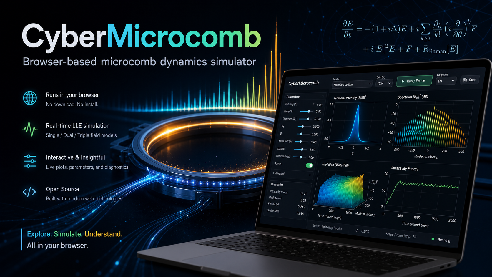

# CyberMicrocomb

> **直接开始使用：** [点击打开 CyberMicrocomb](https://binbin247.github.io/CyberMicrocomb/)
>
> **网址：** https://binbin247.github.io/CyberMicrocomb/
>
> 无需下载、无需安装、无需配置环境。打开上面的链接后，即可直接在浏览器中开始
> microcomb 仿真。



[中文](./README.md) | [English](./README.en.md)

面向微梳动力学的交互式浏览器端 LLE 模拟器。

CyberMicrocomb 是一个纯浏览器实时 Lugiato-Lefever 方程模拟器，基于
React、TypeScript、Vite、Pyodide、NumPy 和 Web Worker 构建。

浏览器负责用户界面。数值求解器通过 Pyodide 在 Web Worker 中本地运行，
因此页面加载完成后不需要 Flask/FastAPI 后端，也不需要服务器端计算。

## 功能

- 归一化参数控制。
- 中英文界面切换。
- 固定网格：256、512、1024、2048 和 4096 点。
- 参数实时更新，不重置当前光场。
- 使用 Plotly 绘制时域、频谱和腔内总能量曲线。
- 使用 Canvas 绘制 waterfall 历史，并用固定 300 帧 ring buffer 保存。
- 侧边文档面板可直接查看当前模型的方程、物理图像、Demo 和参考文献。
- 支持单场、双场和三场模型的时域/频域/能量/演化可视化。
- Raman self-frequency-shift 模型实时显示脉宽和自频移估计；Turnkey 模型显示
  locked detuning 和自注入锁定状态图。
- 导出 JSON 包含模型 ID、参数、当前复场、四张图的完整数据、waterfall 历史，
  以及模型相关诊断量。
- 一阶分步傅里叶 LLE 求解器，支持 D2/D3/D4、mode shift、耦合场、Raman shock
  和 Raman response 卷积等交互式机制模型。
- 支持用户调节积分步长 `dt`，并根据 `max(|Dint|)` 自动限制过大的步长，
  使 `max(|Dint|) * dt < pi`，避免色散相位 aliasing。
- 面向 GitHub Pages 的纯静态部署。

## 模型

当前页面内置六个交互式归一化模型。每个模型都有独立的方程说明、物理图像、
Demo 操作和参考文献：

- [Standard soliton](./docs/models/standard-soliton.md)：反常色散单场 LLE，
  用于亮耗散 Kerr 孤子仿真，并可加入高阶色散和 Raman shock 扰动。
- [Standard dark pulse (platicon)](./docs/models/standard-dark-pulse-platicon.md)：
  正常色散单场 LLE 加局部模式偏移，用于暗脉冲 / platicon 仿真。
- [Stokes soliton](./docs/models/stokes-soliton.md)：Primary / Stokes 双场耦合 LLE，
  用于 Raman 驱动的 Stokes soliton 仿真。
- [Turnkey soliton (self-injection locking)](./docs/models/turnkey-soliton.md)：
  turnkey soliton microcomb 的 self-injection-locking 归一化模型。
- [Multicolor soliton](./docs/models/multicolor-soliton.md)：Primary / signal / idler
  三场耦合 LLE，用于 multicolor interband soliton 机制演示。
- [Raman soliton self-frequency shift](./docs/models/raman-soliton-ssfs.md)：
  使用 Raman response 卷积的 soliton self-frequency shift 仿真。

在网页中，也可以通过 `MODEL` 区域旁边的 `文档` 按钮直接打开当前模型的说明面板。

这些模型面向快速理解和交互式探索。不同文献模型可能采用不同的归一化和符号约定；
每个模型的具体方程、参数定义和适用范围请以对应文档页为准。

## 本地开发

如果想基于 CyberMicrocomb 做自己的模型、界面或文档扩展，可以先把仓库 fork
到自己的 GitHub 账号，然后 clone 自己的 fork：

```bash
git clone https://github.com/<your-github-name>/CyberMicrocomb.git
cd CyberMicrocomb
```

安装依赖并启动本地开发服务器：

```bash
npm install
npm run dev
```

打开终端输出的本地 Vite 地址，通常是：

```text
http://127.0.0.1:5173/
```

首次加载页面需要联网，从 Pyodide CDN 获取 Pyodide 和 NumPy。运行时加载完成后，
当前会话的计算会继续在浏览器本地执行。

二次开发时，可以直接在本地仓库中使用自己的 coding agent，例如 Claude Code、
Codex 或其他代码助手，让它读取项目结构后修改模型方程、默认参数、文档、导出数据
或前端可视化。改完后提交到自己的 fork；如果希望贡献回主仓库，可以从 fork 发起
pull request。

## GitHub Pages

仓库内置 workflow 会把应用构建成静态站点并部署到 GitHub Pages。在仓库设置中，
将 Pages source 设置为 GitHub Actions，然后推送到 `main`。

对于当前仓库名，生产环境 base path 为：

```text
/CyberMicrocomb/
```

workflow 会设置 `GITHUB_PAGES=true`，让 Vite 使用该 base path。
